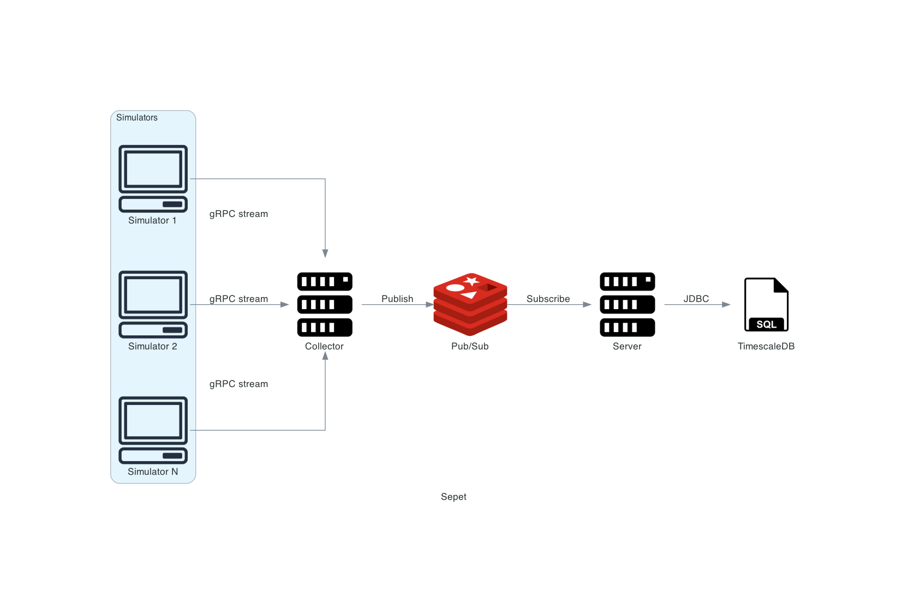

# sepet

An example system simulating some thermometers sending temperature metrics. It is also possible to query these statistics for a given timespan.

Info
====
* Project contains two parts. Collector is responsible for collecting temperature metrics. Server is responsible for persisting and aggregating metrics. Spring Boot used for both of them. 
* Collector collects readings and publishes readings to Redis. Collector collects reading with gRPC streaming.
* Server subscribes that topic and persists them to the database. TimescaleDB used for persistence. It is a time series database built on PostgreSQL.
* For querying temperature metrics Swagger UI is available at `localhost:8081/swagger-ui.html`. `localhost:8081/query` accepts time range and machine-ids and returns map of machine-id and statistics. `localhost:8081/query/machine-id` returns existing machine-ids in database.
* There is a simple simulator for thermometer data. It accepts parameters `-n -h -p`. n is the number of simulators, h is host and p is port of Collector. It uses sine function to generate temperature. Default configuration spans 50 simulators.
* There is no security or machine-id/reading validation implemented.

Requirements
====
* Docker > 18.0.0
* Docker Compose > 1.23.0

Used Technologies
====
* Docker
* Docker Compose
* Java 15
* Spring Boot 2
* Spring Webflux
* Redis
* gRPC
* TimescaleDB

How To Run
====
Go to root folder and run build.sh. It compiles applications, creates docker images and runs.

What is sepet?
====
Turkish word for **basket**. Better than **gRPC-SpringBoot-RedisPubSub-TimescaleDB-Example**.
